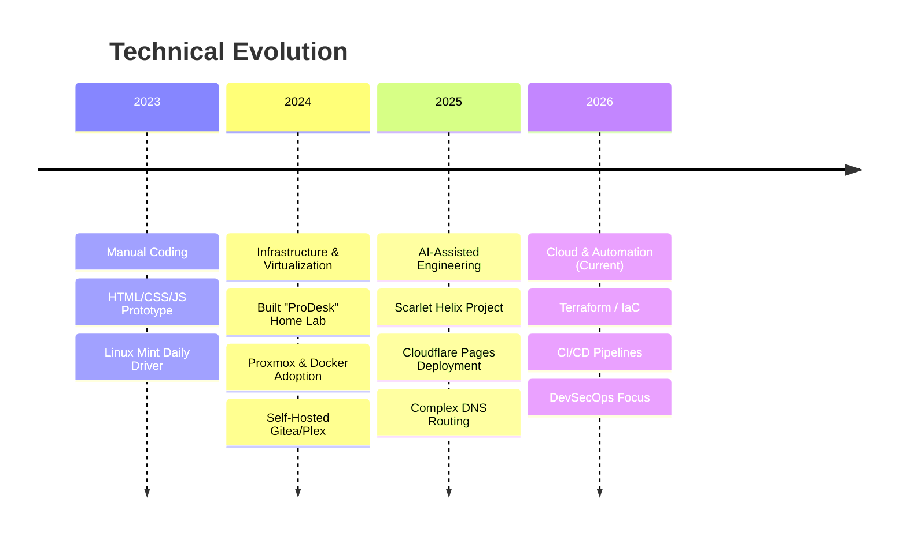

# David Cockson
**Compliance & RegTech Professional | Building Compliance Automation Solutions | Cloud Engineer in Training**

Regulatory compliance professional (UKGC, MGA, GDPR) pivoting to **Cloud Engineering** and **DevSecOps**. I combine 5+ years of regulatory experience with modern implementation skills to build "Compliance-as-Code" solutions.

---

## 🗺️ Developer Journey

My path from manual scripting to AI-augmented Cloud Engineering.

---

## 🚀 Featured Projects

### 🌩️ [Scarlet Helix](https://github.com/davidcockson-compliance/scarlet-helix)
**Tech**: React, Cloudflare Pages, DNS engineering.
*   Intelligence tool for tracking UK Gambling Commission licenses.
*   Solved complex Edge routing challenges using `dpdns.org`.

### 🏠 [Home Lab Infrastructure](https://github.com/davidcockson-compliance/homelab)
**Tech**: Proxmox, Ubuntu, Docker, Tailscale.
*   Enterprise-grade virtualization stack running on bare metal.
*   Hosts internal tooling, media servers, and secure mesh networking.

### 🏭 [Job Radar](https://github.com/davidcockson-compliance/job-radar-)
**Tech**: TypeScript, Node.js, Prisma.
*   Full-stack pipeline tracker with automated data scraping.
*   Currently being refactored for **AWS Cloud Native** deployment.

---

## 💼 Professional Background

**Gambling Commission** | *Compliance Manager* (2024–Present)
*   Evaluating technical compliance challenges within evolving regulatory environments.

**William Hill (888 Holdings)** | *Regulatory Compliance Assurance Manager* (2023)
*   Implemented automation frameworks for RTS testing.

**Allwyn UK** | *Compliance Officer* (2022–2023)
*   Translated regulatory requirements into technical specifications (BRDs).

---

## 📫 Connect
*   [Email](mailto:DavidCockson@gmail.com)
*   [LinkedIn](https://www.linkedin.com/in/david-cockson/)
