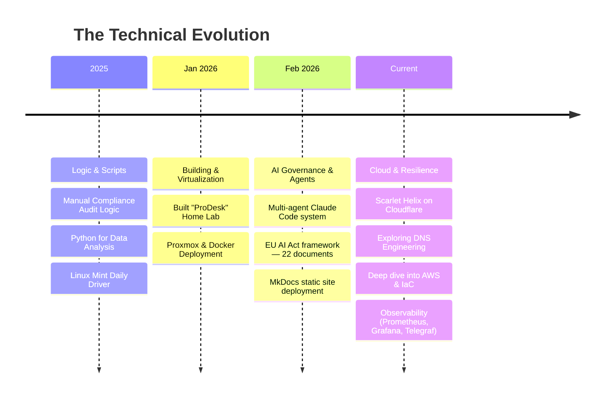

# David Cockson

**Compliance & AI Governance | Bridging Regulatory Logic with Cloud Infrastructure**

https://www.linkedin.com/in/david-cockson

I like figuring out how things work—and more importantly, why they don't.

With over 8 years in international regulatory compliance (Gambling, Marketing, GDPR), I've spent my career navigating complex rules. Now I'm spending my time under the hood: building tools that turn policy-on-paper into resilient, automated systems — and lately, designing multi-agent AI architectures that produce governance documentation autonomously.

---

## Featured Projects

### [pickles-gmbh-ai-governance-framework](https://github.com/davidcockson-compliance/pickles-gmbh-ai-governance-framework)

An open-source AI governance framework for German legal AI providers, covering EU AI Act, GDPR, BDSG, and BRAK professional standards. 22 documents across five stages plus a worked example.

The more interesting part: the framework was produced by a multi-agent Claude Code system with defined agent roles — Orchestrator, Research Reader, Document Drafter, Assumptions Tracker, Run Summariser. Autonomous overnight runs. Human review layer. The documents are the output. The system design is the methodology.

**Stack:** Claude Code · Multi-agent architecture · Markdown · MkDocs · GitHub Pages  
**Licence:** CC BY 4.0

[Repository](https://github.com/davidcockson-compliance/pickles-gmbh-ai-governance-framework) · [Documentation site](https://davidcockson-compliance.github.io/pickles-gmbh-ai-governance-framework/)

---

### [homelab-monitoring](https://github.com/davidcockson-compliance/homelab-monitoring)

A lightweight Prometheus + Grafana monitoring stack for a home server. Provides host-level visibility (CPU, RAM, Disk via node_exporter) and per-container metrics (via Telegraf and the Docker socket API), all orchestrated with Docker Compose.

**Stack:** Prometheus · Grafana · Telegraf · node_exporter · Docker Compose

---

## 🗺️ Systems Exploration

My journey from evaluating policy to building and breaking infrastructure.

