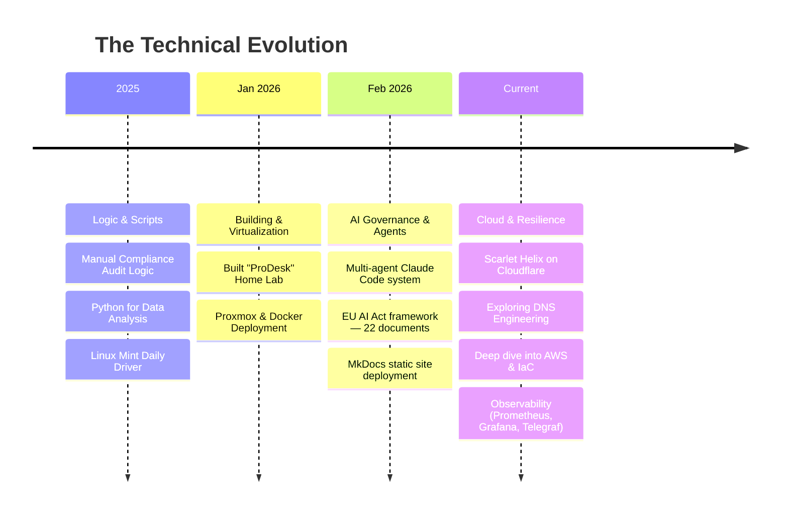

# David Cockson

**Chaos-tolerant systems architect. Making AI govern itself.**

https://www.linkedin.com/in/david-cockson

8 years finding the gaps in complex regulatory systems. Now I build the things that close them.

Currently: designing multi-agent AI workflows that generate governance documentation, while building practical systems and deployment capability through homelab and cloud-based projects.

*Tao of Pratchett. Map the gap. Architect the control.*

---

## Featured Projects

### [pickles-gmbh-ai-governance-framework](https://github.com/davidcockson-compliance/pickles-gmbh-ai-governance-framework)

There weren't clear open-source examples of what EU AI Act compliance looks like in practice for a legal AI company. So I built an engine to make one.

A multi-agent Claude Code system — Orchestrator, Research Reader, Document Drafter, Assumptions Tracker, Run Summariser — running autonomously overnight, producing audit-ready governance documentation with explicit assumption flagging throughout. The output is 22 documents across five stages plus a worked example. The methodology is the point.

**Stack:** Claude Code · Multi-agent architecture · Markdown · MkDocs · GitHub Pages  
**Licence:** CC BY 4.0

[Repository](https://github.com/davidcockson-compliance/pickles-gmbh-ai-governance-framework) · [Documentation site](https://davidcockson-compliance.github.io/pickles-gmbh-ai-governance-framework/)

---

### [homelab-monitoring](https://github.com/davidcockson-compliance/homelab-monitoring)

Prometheus + Grafana monitoring stack for a home server. Host metrics via node_exporter, per-container visibility via Telegraf and the Docker socket API, orchestrated with Docker Compose. Air-gapped from the public internet — Tailscale only.

**Stack:** Prometheus · Grafana · Telegraf · node_exporter · Docker Compose

---

## 🗺️ How We Got Here

