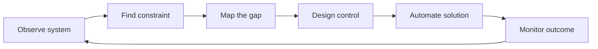

# David Cockson

**Systems thinker. Finding constraints. Designing control.**

`regulation → system → constraint → control → automation`

https://www.linkedin.com/in/david-cockson


---

# Background

For the last **8 years I’ve worked inside complex regulatory systems**, primarily in the gambling industry.

My job was rarely just policy or compliance.

It involved:

- identifying structural weaknesses in regulatory frameworks  
- investigating systemic failures across organisations and suppliers  
- designing operational controls to stabilise complex systems  

In practice this meant constantly asking:

> **Where is the constraint?**  
> **What breaks first?**  
> **What control stabilises the system?**

That mindset translates naturally into **software systems, infrastructure and automation**.

---

# Selected Projects

## AI Governance Frameworks

Live projects exploring structured governance approaches for AI systems.

- **Sable AI Governance Framework**  
  https://davidcockson-compliance.github.io/sable-ai-governance-framework/

- **Pickles GmbH AI Governance Framework**  
  https://davidcockson-compliance.github.io/pickles-gmbh-ai-governance-framework/

These explore how governance frameworks can be generated and maintained through **structured system design and AI-assisted workflows**.

---

## Regulatory & Analysis Tools

### Scarlet Helix

Monitoring and analysis tool for the **UK Gambling Commission licence register**.

Key capabilities:

- licence register search and analysis  
- domain and infrastructure discovery  
- corporate group identification  
- compliance monitoring views  

Repository:  
https://github.com/davidcockson-compliance/scarlet-helix

Live instance:  
https://froghunter.dpdns.org/

---

### LCCP Regulation Filter

Structured dataset and filtering tool for the **UK Gambling Commission regulatory framework**.

Purpose:

- convert regulatory text into structured data
- allow filtering and gap analysis
- support compliance review workflows

---

## Infrastructure & Homelab

Current experimentation environment used to practise:

- containerisation (Docker)
- cloud infrastructure
- deployment workflows
- monitoring and observability

Projects and experiments are built with the goal of creating **repeatable operational systems**.

---

# Journey

My background is **systems analysis inside regulatory environments**.

I now apply the same mindset to **software systems and infrastructure**.

Progression of projects:

```
Regulatory systems analysis
        ↓
Structured regulation datasets
        ↓
Compliance tooling (React + data models)
        ↓
Automation and deployment (Docker / Cloudflare)
        ↓
Cloud infrastructure experimentation
        ↓
Monitoring and observability systems
```

Each project builds on the previous one.

The focus is moving from:

**analysis → tooling → infrastructure → automation**

---

# How I Approach Systems


```mermaid
flowchart LR
A[Observe system] --> B[Find constraint]
B --> C[Map the gap]
C --> D[Design control]
D --> E[Automate solution]
E --> F[Monitor outcome]
F --> A
```

This loop applies whether the system is:

- regulatory frameworks  
- operational processes  
- infrastructure platforms  
- AI workflows  

Understand the system.  
Remove the constraint.  
Let automation keep it stable.

---

# Current Focus

I am currently building skills and projects around:

- Linux systems and tooling
- Docker and container infrastructure
- cloud infrastructure and deployment
- monitoring and observability
- AI governance and agent workflows

Most learning happens through **practical builds and homelab experimentation**.

---

*Tao of Pratchett.*

**Map the gap. Architect the control.**
