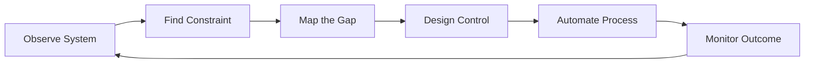
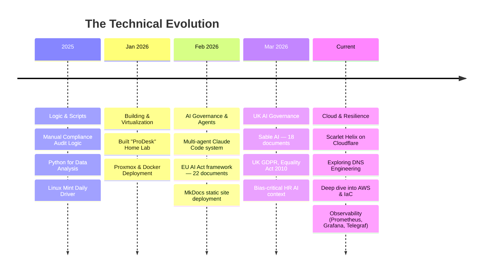

# David Cockson

**Systems thinker. Finding constraints. Designing control.**

https://www.linkedin.com/in/david-cockson

---

## Background

For the last **8 years I’ve worked inside complex regulatory systems**, primarily in the gambling industry.

My job was rarely just “compliance”.

It involved:

- identifying structural weaknesses in regulatory frameworks  
- investigating systemic failures across organisations and regulators  
- designing operational controls that keep large systems stable  

In practice this meant constantly asking:

> **Where is the constraint?  
> What breaks first?  
> What control would stabilise this system?**

That way of thinking translates surprisingly well to **software infrastructure**.

---

## Current Focus

I now apply the same systems thinking to **software, infrastructure, and automation**.

Areas I’m actively building in:

- cloud infrastructure and containerisation  
- monitoring and observability systems  
- automation and operational tooling  
- AI governance frameworks and agent workflows  

Most projects are built through a mix of **homelab experimentation and cloud deployments**, focusing on practical systems rather than theory.

---

## Selected Projects

**Scarlet Helix**  
Monitoring and analysis tool for the UK Gambling Commission licence register.

**AI Governance Frameworks**  
Explorations into how multi-agent AI systems can generate governance and compliance artefacts.

**Homelab Monitoring Stack**  
Self-hosted infrastructure used to experiment with containerisation, observability, and deployment pipelines.

---

## How I Approach Systems

```mermaid
flowchart LR

A[Observe System] --> B[Find Constraint]
B --> C[Map the Gap]
C --> D[Design Control]
D --> E[Automate Process]
E --> F[Monitor Outcome]
F --> A
```

The same loop appears everywhere:

- regulatory frameworks  
- operational processes  
- infrastructure platforms  
- AI systems  

Understand the system.  
Remove the constraint.  
Let automation keep it stable.

---

## Current Learning

- Linux systems and tooling  
- Docker and container infrastructure  
- cloud deployment patterns  
- observability and monitoring  
- AI governance and agent workflows  

---

*Tao of Pratchett.*

**Map the gap. Architect the control.**
---

## Featured Projects

### [pickles-gmbh-ai-governance-framework](https://github.com/davidcockson-compliance/pickles-gmbh-ai-governance-framework)

There weren't clear open-source examples of what EU AI Act compliance looks like in practice for a legal AI company. So I built an engine to make one.

A multi-agent Claude Code system — Orchestrator, Research Reader, Document Drafter, Assumptions Tracker, Run Summariser — running autonomously overnight, producing audit-ready governance documentation with explicit assumption flagging throughout. The output is 22 documents across five stages plus a worked example. The methodology is the point.

**Stack:** Claude Code · Multi-agent architecture · Markdown · MkDocs · GitHub Pages  
**Licence:** CC BY 4.0

[Repository](https://github.com/davidcockson-compliance/pickles-gmbh-ai-governance-framework) · [Documentation site](https://davidcockson-compliance.github.io/pickles-gmbh-ai-governance-framework/)

---
 ### [sable-ai-governance-framework](https://github.com/davidcockson-compliance/sable-ai-governance-framework)

  The same multi-agent engine, different jurisdiction and risk surface.

  Sable AI Ltd is a fictional UK HR startup building Scout — an AI CV screening and shortlisting tool. The framework applies UK
  GDPR, DPA 2018, the Data (Use and Access) Act 2025, and Equality Act 2010 to a bias-critical use case where automated processing
  has direct consequences for candidate employment rights. 18 documents across five stages plus worked examples; the Phase 2
  section covers Scout end-to-end.

  **Stack:** Claude Code · Multi-agent architecture · Markdown · MkDocs · GitHub Pages
  **Licence:** CC BY 4.0

  [Repository](https://github.com/davidcockson-compliance/sable-ai-governance-framework) · [Documentation
  site](https://davidcockson-compliance.github.io/sable-ai-governance-framework/)

  ---
### [homelab-monitoring](https://github.com/davidcockson-compliance/homelab-monitoring)

Prometheus + Grafana monitoring stack for a home server. Host metrics via node_exporter, per-container visibility via Telegraf and the Docker socket API, orchestrated with Docker Compose. Air-gapped from the public internet — Tailscale only.

**Stack:** Prometheus · Grafana · Telegraf · node_exporter · Docker Compose

---

## 🗺️ How We Got Here

```mermaid
timeline
    title The Technical Evolution
        2025 : Logic & Scripts
             : Manual Compliance Audit Logic
             : Python for Data Analysis
             : Linux Mint Daily Driver
    Jan 2026 : Building & Virtualization
             : Built "ProDesk" Home Lab
             : Proxmox & Docker Deployment
    Feb 2026 : AI Governance & Agents
             : Multi-agent Claude Code system
             : EU AI Act framework — 22 documents
             : MkDocs static site deployment
    Mar 2026 : UK AI Governance
             : Sable AI — 18 documents
             : UK GDPR, Equality Act 2010
             : Bias-critical HR AI context
     Current : Cloud & Resilience
             : Scarlet Helix on Cloudflare
             : Exploring DNS Engineering
             : Deep dive into AWS & IaC
             : Observability (Prometheus, Grafana, Telegraf)
```
