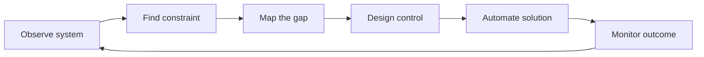

# David Cockson

**Infrastructure · Observability · AI Workflows**

`regulation → system → constraint → control → automation`

I build self-hosted infrastructure, monitoring stacks, and AI tooling
from my homelab. Most of what I ship is open source.

📍 Macclesfield, UK  
🔗 [davidcockson.com](https://davidcockson.com) · [blog](https://blog.davidcockson.com) · [linkedin](https://www.linkedin.com/in/david-cockson) · hello@davidcockson.com


---

## Current Focus

- self-hosted infrastructure on Proxmox + Docker
- observability (Prometheus, Grafana, Tempo, OpenTelemetry)
- infrastructure-as-code (Terraform, CI/CD pipelines)
- distributed AI systems (LLM routing, MCP, agent workflows)

---

## Selected Projects

### vault-runner

Self-hosted LLM job runner that turns an Obsidian vault into a distributed AI workbench.

- file-based job queue (`_queue → _active → _completed`) driven from markdown
- multi-machine model routing across a VPS and home server
- semantic memory via MemPalace MCP — past outputs retrieved with one YAML flag
- OpenTelemetry traces to Tempo/Grafana, Discord alerts on failure
- FastAPI + HTMX dashboard with live SSE output streaming
- 76 tests · GitLab CI · auto-deploy on merge

→ [davidcockson-compliance/vault-runner](https://github.com/davidcockson-compliance/vault-runner)

---

### scarlet-helix

Monitoring tool for the UK Gambling Commission licence register — domain
discovery, corporate group identification, compliance views.

→ [repo](https://github.com/davidcockson-compliance/scarlet-helix) · [live](https://scarlet-helix.davidcockson.com)

---

### lccp-regulation-filter

Converts the UK Gambling Commission's LCCP regulations into a structured
dataset with filtering and gap-analysis tooling.

→ [repo](https://github.com/davidcockson-compliance/lccp-regulation-filter) · [live](https://lccp-filter.davidcockson.com)

---

### homelab-monitoring

Prometheus + Grafana stack for a home server. Host metrics and
per-container visibility via Docker exporters.

→ [repo](https://github.com/davidcockson-compliance/homelab-monitoring)

---

### infra-practice

Terraform and Python automation practice — IaC patterns, CI/CD pipelines,
repeatable cloud deployments.

→ [repo](https://github.com/davidcockson-compliance/infra-practice)

---

### AI Governance Frameworks

Structured governance models for AI systems, generated and maintained with
AI-assisted workflows.

- [Sable AI Governance Framework](https://davidcockson-compliance.github.io/sable-ai-governance-framework/)
- [Pickles GmbH AI Governance Framework](https://davidcockson-compliance.github.io/pickles-gmbh-ai-governance-framework/)

---

## Recent writing

- [Did the Supply Chain Attack Compromise Me? A Morning Panic Check](https://blog.davidcockson.com/posts/supply-chain-attack-check/) — 31 Mar 2026
- [LCCP Filter — Self-Made Tools](https://blog.davidcockson.com/posts/lccp-filter-self-made-tools/) — 26 Mar 2026
- [Monitoring & Observability Journey](https://blog.davidcockson.com/posts/monitoring-observability-journey/) — 25 Mar 2026

[More at blog.davidcockson.com →](https://blog.davidcockson.com)

---

## How I Approach Systems


```mermaid
flowchart LR
A[Observe system] --> B[Find constraint]
B --> C[Map the gap]
C --> D[Design control]
D --> E[Automate solution]
E --> F[Monitor outcome]
F --> A
```

The loop applies whether the system is regulatory, operational, infrastructural,
or an AI workflow. Systems fail at the constraint. Find it, control it,
automate around it.

---

## Background

Eight years inside complex regulatory systems, mostly in the UK gambling
industry. The work wasn't policy — it was finding structural weaknesses,
investigating systemic failures, and designing operational controls to
stabilise things.

The questions were always the same:

> Where is the constraint?  
> What breaks first?  
> What control stabilises the system?

Those questions work just as well on infrastructure, pipelines, and
distributed systems as they did on compliance frameworks.

---

## Journey

```
Regulatory systems analysis
        ↓
Structured regulation datasets
        ↓
Compliance tooling (React + data models)
        ↓
Automation and deployment (Docker / Cloudflare)
        ↓
Cloud infrastructure experimentation
        ↓
Monitoring and observability systems
        ↓
AI infrastructure and agent workflows
```

Each step builds on the previous one. Direction of travel:
**analysis → tooling → infrastructure → automation.**

---

## Principles

- systems fail at the constraint
- the goal isn't complexity — it's stability when nobody is watching
- automate the boring stuff; monitor everything that matters
- ship small, measure, iterate

**Map the gap. Architect the control.**
